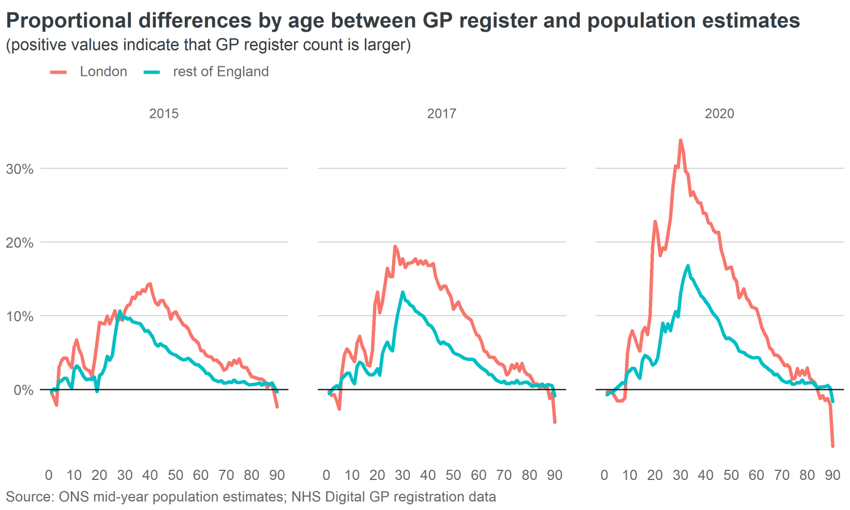

<!-- README.md is generated from README.Rmd. Please edit that file -->

```{r, include = FALSE}
knitr::opts_chunk$set(
  collapse = TRUE,
  comment = "#>",
  fig.path = "man/figures/README-",
  out.width = "100%"
)
```

# process published nhs data

<!-- badges: start -->
<!-- badges: end -->

Since 2012, the City Intelligence Unit's Demography Team made has use of extracts of patient register data as part of its ongoing analysis of population change.  These extracts were provided under license by the NHS and consisted of aggregate counts of persons registered with a GP by age, sex, and area of residence.  

In recent years, NHS Digital has regularly published data about the numbers of persons present on GP patient registers. Two datasets are available: 

1. Counts of patients by practice attended x sex x LSOA of residence - published quarterly

2. Counts of patients by practice attended x sex x age - published monthly

The purpose of the code in this repository is to take these published data and consolidate them into a time series of patient **counts by sex x age x Local Authority District of residence** that can be used as the basis for subsequent demographic analysis. Modelled counts of patients by age, sex, and local authority of residence are created by a simple process of apportioning the data for each GP practice in (2) by the distribution for each practice in (1).

The underlying data are published on the [NHS Digital website](https://digital.nhs.uk/data-and-information/publications/statistical/patients-registered-at-a-gp-practice). Each month's extracts are published on their own pages, which usually follow the naming convention: 
```
.../patients-registered-at-a-gp-practice/<month>-<year>
```

The data is published in csv files in a format that conforms to the tidy data convention. There are minor inconsistencies in the formatting, naming, and location of extracts published over the years which this code aims to workaround.

## Usage

The individual scripts in /R folder can be run individually in order or together via *run_all_manual.R*

* **1_fetch_nhs_files.R**

Downloads the published data files for individual months from the NHS Digital website and saves them in folders created with the naming convention:
```
/data/raw/<yyyy_mm>
```

* **2_process_sya_data.R**

Cleans and standardises the format of data published by practice, age and sex, saving separate files for each month in 
```
/data/processed/gp_sya/
```

* **3_process_residence_data.R**

Takes the raw data published by practice, sex and LSOA of residence; aggregates counts to local authority district of residence. Data for each month is saved in 
```
/data/processed/gp_res/
```

* **4_apportion_sya_data_to_lad_residence.R**

For each practice, calculates proportions of patients resident in each local authority district; applies these to the counts of patients by age and sex in the practice; then aggregates the results by age, sex, and LAD of residence. 

As residence data is only published quarterly, proportions for intermediate months are based on interpolation. Proportions based on the most recently published residence data are used for subsequent months.

The resulting outputs for each month are saved in 
```
/data/processed/gp_res_sya/
```

* **5_create_output_files.R**

Combines local authority data for indidual months into a single file, then creates aggregations of this data for regions and ITL2 subregions. These outputs are saved in 
```
/data/processed/
```

## Note on using patient register data

Patient register data can be used to provide frequent low-latency indicators of changing population trends.  However, patient counts should not be interpreted as a direct proxy for population.  Patient counts have been prone to compounding inflation in recent years, primarily as a result of failures to remove former patients that have since moved overseas (local inflation/deficits also occur due to delays in patients updating their records or registering with a new GP when moving within the UK).

The rate of inflation varies by area, sex, and age, being greatest for:

* areas with high volumes of international migration

* adults age 20-30 (with the impact spreading to older groups over time) 

* males - due to typically lower levels of interaction with health services


